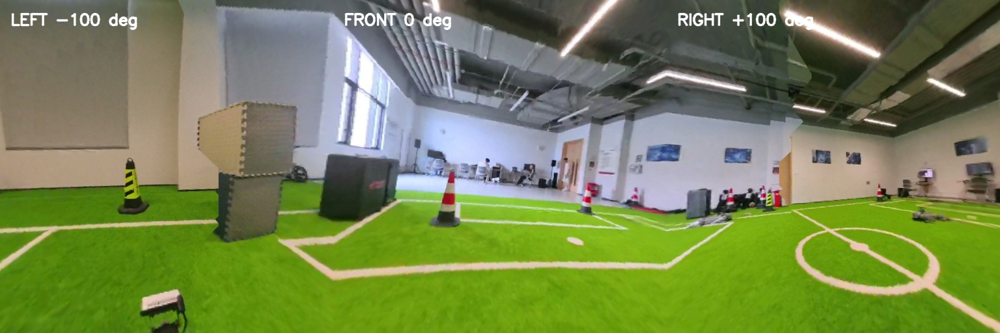

# Insta360 X5 × Unitree GO2 360° Data Pipeline

> Synchronized raw dual-fisheye ROS2 capture, recoverable GO2 field recording, and calibration-aware 360° post-processing for Insta360 X5.

This project turns an Insta360 X5 mounted on a Unitree GO2 into a repeatable data-collection pipeline. It records synchronized lens images and robot telemetry, preserves raw data for offline processing, and produces a `2:1` panorama, six-face cubemap, and a combined 300° left/front/right view.

Robot integration is deliberately read-only: the software subscribes to Unitree state but never publishes motion commands.

## Highlights

- **Synchronized ROS2 images** — publishes `/fisheye1/image_raw` and `/fisheye2/image_raw` with identical timestamps.
- **Post-processing first** — stores `1920 × 1920` `bgr8` image messages without an additional JPEG compression pass.
- **Reliable rosbag2 capture** — writes paired CDR messages directly to a Foxy-compatible SQLite bag, avoiding loss of very large images through a second DDS hop.
- **GO2 field recorder** — records X5 streams, timestamps, gyro/exposure samples, Unitree state, run metadata, and SHA-256 manifests.
- **Complete 360° outputs** — returns a panorama and `F/R/B/L/U/D` cubemap, plus left/front/right inspection views.
- **X5-aware stitching** — uses factory-derived lens geometry, polynomial lookup tables, full rotations, and a temporally smoothed content-aware seam.

## Verified on the robot

The live X5/GO2 test on 2026-07-17 recorded both image topics at `10.10 Hz`: 20 left frames and 20 right frames over 1.98 seconds, with equal first/last timestamps and verified checksums. A separate replay exported 29/29 exact PNG pairs with zero unmatched timestamps.

Raw decoded image payload is approximately `13 GB/minute` at 10 Hz, so choose short independent bags and retain storage headroom.



## Data flow

```text
Insta360 X5 live H.264 preview
              │
              ▼
       CameraSDK owner
              │
              ▼
     GStreamer BGR decode
              │
              ├── /fisheye1/image_raw ─┐
              └── /fisheye2/image_raw ─┴── rosbag2 SQLite
                                                │
                                                ▼
                                      lossless paired PNG export
                                                │
                   ┌────────────────────────────┼──────────────────────┐
                   ▼                            ▼                      ▼
             2:1 panorama             F/R/B/L/U/D cubemap     300° inspection view
```

The ROS messages contain decoded pixels from the X5 live-preview stream. The ROS layer does not apply JPEG or another lossy re-encode. This is not the same as a sensor-native DNG capture because the camera preview arrives as H.264.

## Quick start: raw ROS2 bag on GO2

The supported deployment directory on the GO2-mounted computer is `~/ws_datacollection`.

```bash
cd ~/ws_datacollection

# Record for 10 seconds at a target 10 synchronized pairs per second.
bash scripts/record_rosbag_raw.sh 10 10

# Inspect and losslessly export a completed run.
ros2 bag info runs/<run>/bag
bash scripts/export_rosbag_raw.sh runs/<run>/bag runs/<run>_export

# Generate panorama, cubemap and 300° products.
source .venv-jetson/bin/activate
x5-ros-postprocess runs/<run>_export runs/<run>_postprocess
```

Every completed capture validates equal topic counts, matching timestamp bounds, at least 80% of the target frame rate, readable rosbag metadata, and SHA-256 checksums. See the [raw rosbag guide](docs/rosbag_raw_pipeline.md) for storage planning, output layout, and failure rules.

## Field acquisition with GO2 telemetry

Prepare the deployment package on Windows when the CameraSDK archives are local:

```powershell
powershell -ExecutionPolicy Bypass -File scripts/package_deployment.ps1
```

Install and test on the GO2-mounted Ubuntu computer:

```bash
cd ~/ws_datacollection
bash scripts/install_jetson.sh
source .venv-jetson/bin/activate
python -m unittest discover -s tests -v

bash scripts/build_x5_sdk_recorder.sh
bash scripts/preflight.sh config/jetson_go2_x5_sdk.json
bash scripts/record_x5_sdk_go2.sh config/jetson_go2_x5_sdk.json 60
```

Set `go2.interface` to the interface connected to the robot controller, normally `eth0`. Do not replace the JetPack OpenCV/CUDA stack or the robot's native CycloneDDS installation. The [field guide](docs/go2_field_guide.md) contains the operator checklist and stop criteria.

## Python API

Install the desktop pipeline:

```bash
pip install -e .
```

Process a side-by-side BGR frame:

```python
from x5_360_pipeline import X5CubemapPipeline

pipeline = X5CubemapPipeline(2944, 2944)
result = pipeline.process_side_by_side(side_by_side_bgr)

panorama_bgr = result.panorama
front_bgr = result.faces["F"]
back_bgr = result.faces["B"]
```

For separate images, call `pipeline.process(left_bgr, right_bgr)`. All inputs and outputs use BGR channel order.

## Output contract

| Output | Default shape | Intended use |
| --- | --- | --- |
| Panorama | `1280 × 640` BGR | Recording, visualization, panorama processing |
| Cubemap | Six `512 × 512` BGR faces | Complete all-direction perception |
| ROS lens topics | Two `1920 × 1920` `bgr8` images | Lossless post-processing input after preview decode |
| JPEG payloads | Optional | Transmission or report artifacts only |

Cubemap face order is always `F/R/B/L/U/D`. Neither the panorama nor cubemap infers metric depth.

## Calibration and performance

The X5 preset scales the `p2` factory lens circles from a `10752 × 5376` source canvas and combines independent circle geometry with full per-lens rotations and fifth-order radial curves. In the overlap it chooses a low-cost source path instead of averaging duplicated or obstructed content. Maps are cached at startup, and the seam is temporally smoothed and reused between updates.

Desktop measurements for a `1280 × 640` panorama and six `512 × 512` faces:

| Workload | Average | Throughput | p95 |
| --- | ---: | ---: | ---: |
| Stitch only | 22.12 ms | 45.21 FPS | — |
| Panorama + cubemap | 32.92 ms | 30.38 FPS | 59.06 ms |

These figures are not a GO2/RK3588S guarantee. Validate the complete workload on the target platform.

## Validation

```bash
# Acquisition and serialization contracts.
python -m unittest discover -s tests -v

# Optional DNG geometry/seam regression.
pip install rawpy
python tools/validate_x5_samples.py /path/to/dngs /path/to/output
```

Generated bags, encoded camera streams, validation JPEGs, and runtime reports belong under ignored `runs/` or another external output directory. Only small, intentional documentation artifacts are kept in the repository.

## Repository layout

| Path | Purpose |
| --- | --- |
| `x5_360_pipeline/` | Supported panorama-plus-cubemap API |
| `x5_ros/` | ROS2 image publication, direct bag writing, export, and post-processing |
| `go2_experiment/` | Read-only Unitree telemetry and recoverable field recording |
| `native/` | X5 CameraSDK recorder and FIFO bridge |
| `config/` | Dry-run, SDK, and robot acquisition profiles |
| `scripts/` | Installation, preflight, capture, export, and packaging commands |
| `tests/` | Acquisition and serialization regression tests |
| `docs/` | Architecture, implementation, field reports, and operational constraints |

## Safety and limitations

- Acquisition code does not command the GO2. Physical motion remains under the onsite operator and official remote.
- No ROS `CameraInfo` is published until trustworthy per-lens calibration exists; factory stitch parameters must not be presented as pinhole intrinsics.
- Static geometry cannot eliminate near-field parallax, and seam selection cannot create a depth-correct view.
- The live-preview path starts from camera-generated H.264. Use the appropriate native photo mode when sensor-level DNG data is required.
- Camera-to-robot extrinsics still require a dedicated calibration before geometric robot-perception use.

See the [project overview](docs/project_overview.md), [deployment report](docs/jetson_deployment_report.md), and [module documentation](docs/modules/) for implementation details and design constraints.
