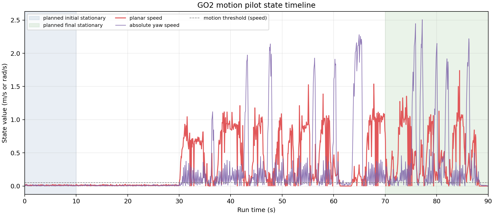
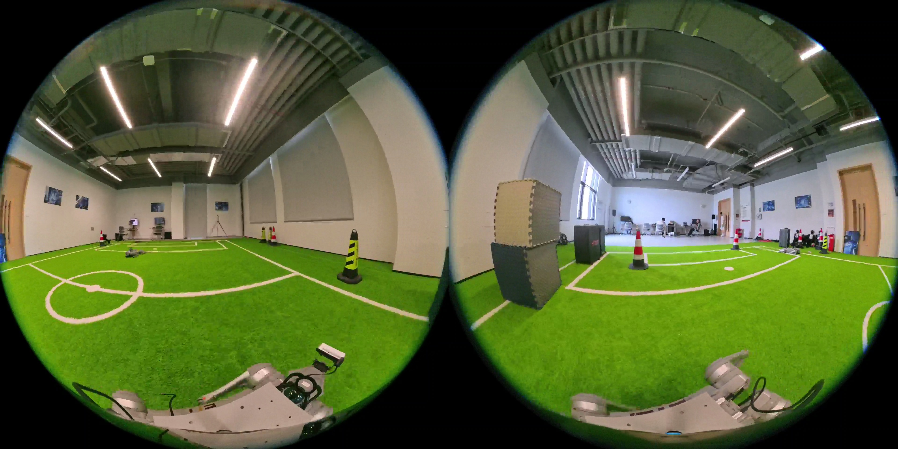
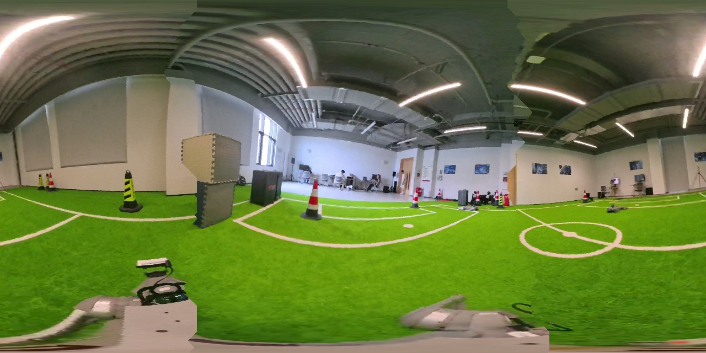
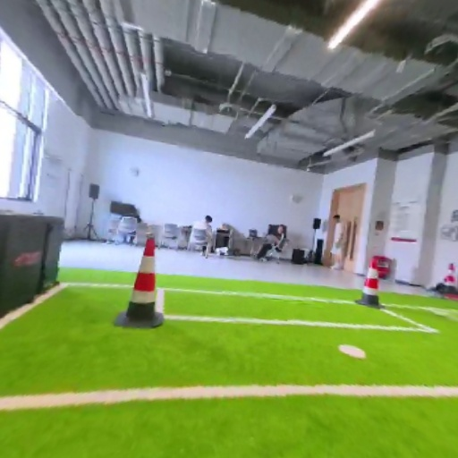
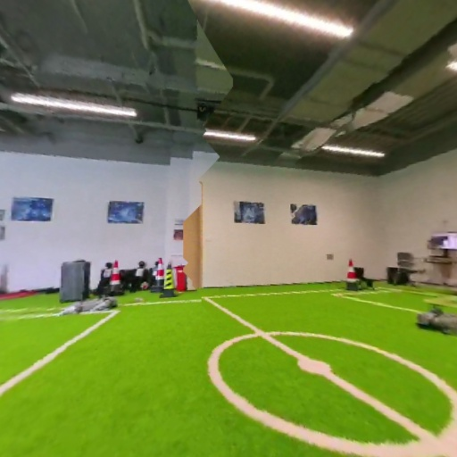
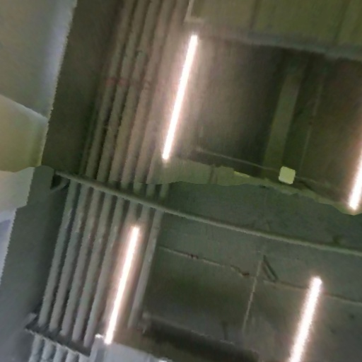
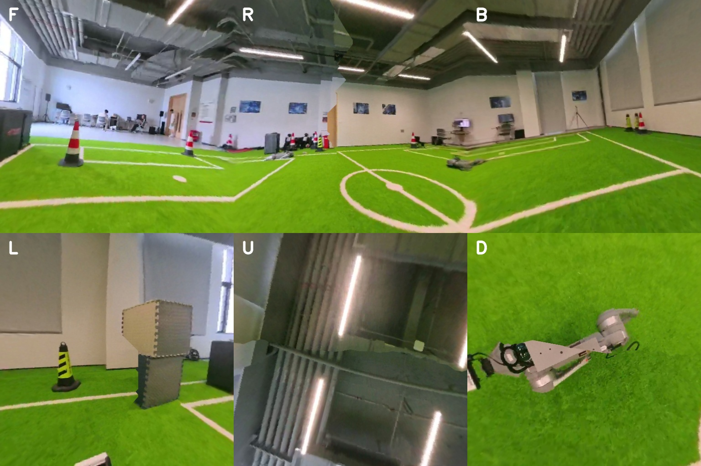

# GO2 + Insta360 X5 Controlled-Motion Data Report

Date: 2026-07-17

Run: `20260717_125935_jetson_go2_x5_motion_pilot`

Robot project: `/home/unitree/ws_datacollection`
Raw run directory: `/home/unitree/ws_datacollection/runs/20260717_125935_jetson_go2_x5_motion_pilot`

## Result

The first real-motion acquisition completed without a camera or telemetry process failure. The X5 primary stream, camera gyro/exposure data, GO2 LowState, and GO2 SportModeState were recorded together. Queue-drop counters were zero, a representative motion frame decoded successfully, and the deployed panorama/cubemap algorithm ran successfully. The original validation stage retained 19 artifacts; the later six-face/300° evaluation expanded the run to 32 artifacts, all of which passed SHA-256 verification.

This is a technically valid motion dataset. It is not labeled as a full procedural pass because state telemetry showed motion until approximately 88.1 seconds instead of the planned final 20-second stationary segment, and reported peak planar speed exceeded the intended first-pilot low-speed envelope.

## Acquisition summary

| Item | Result |
|---|---:|
| Requested capture duration | 90 s |
| Manifest | `complete` |
| X5 recorder exit status | 0 |
| GO2 telemetry exit status | 0 |
| X5 model / firmware | Insta360 X5 / `v1.11.6` |
| X5 serial | `IAHEA26067UB3R` |
| X5 primary chunks | 2,699 |
| X5 primary stream size | 94,299,036 bytes |
| Approximate stream rate | 29.99 chunks/s |
| X5 gyro rows | 45,320 |
| X5 exposure rows | 2,699 |
| LowState records | 4,274 at 47.47 Hz |
| SportModeState records | 1,130 at 12.56 Hz |
| Telemetry queue drops | 0 |
| Final retained artifacts after multi-view evaluation | 32 |
| SHA-256 verification | all passed |

## Robot-state summary

Motion detection here is a report-level heuristic: planar speed above `0.05 m/s` or absolute yaw speed above `0.1 rad/s`. It does not change the raw data.

| Metric | Value |
|---|---:|
| First detected motion | 30.10 s |
| Last detected motion | 88.15 s |
| Maximum planar speed | 1.740 m/s |
| 95th-percentile planar speed | 1.030 m/s |
| Maximum absolute yaw speed | 2.507 rad/s |
| Estimated position span X/Y/Z | 5.621 / 9.558 / 0.039 m |
| Battery SOC start / end | 62% / 62% |
| Voltage range | 29.473–30.040 V |
| Current range | 0.786–16.407 A |
| Maximum observed motor temperature | 56°C |
| Reported state error-code set | 1013, 1017 |

The position span is the robot state estimator's relative output, not an externally surveyed trajectory. Error codes are retained exactly as received and are not interpreted in this report; the onsite operator reported no App/remote fault indication before the run.

## Deployed algorithm check

A frame was decoded sequentially at approximately 45 seconds, during the detected motion interval, then processed on the GO2-mounted Jetson.

| Output | Result |
|---|---:|
| Input dual-fisheye frame | `3840x1920x3` |
| Panorama | `1280x640x3` |
| Cubemap | six `512x512x3` faces |
| Repetitions | 6 |
| Mean processing time | 62.05 ms |
| p95 processing time | 108.15 ms |
| Mean throughput | 16.12 FPS |

### Decoded X5 dual-fisheye frame at 45 seconds

### Generated panorama

### Selected cubemap faces

Front:

Right:

Up:

## Full-pipeline timing and multi-view evaluation

The 300° operator/perception view is defined as three perspective panels:

- left: center yaw `-100°`, horizontal/vertical FOV `100°`;
- front: center yaw `0°`, horizontal/vertical FOV `100°`;
- right: center yaw `+100°`, horizontal/vertical FOV `100°`.

At the horizontal centerline these panels continuously cover `-150°…+150°`, leaving a 60° rear sector. Each panel is `512x512`. The six cube faces remain `512x512` in `F/R/B/L/U/D` order and cover the full sphere.

All timings below were measured on the GO2-mounted Jetson with the recorded `3840x1920` X5 stream. Steady-state timings exclude the one-time lookup-table initialization unless stated otherwise.

| Stage | Mean | p95 | Equivalent rate |
|---|---:|---:|---:|
| H.264 sequential decode | 21.99 ms | 41.34 ms | 45.48 FPS |
| Dual fisheye → panorama + six cube faces | 62.77 ms | 100.07 ms | 15.93 FPS |
| Panorama → left/front/right 100° views | 26.99 ms | 33.12 ms | 37.04 FPS |
| Decoded BGR → panorama + six cube + three direction views | 89.77 ms | 129.92 ms | 11.14 FPS |
| JPEG encode/write of 11 output images | 37.31 ms | 37.49 ms | 26.80 sets/s |
| **Direct full path: H.264 frame → all views → 11 JPEG files** | **159.83 ms** | **238.17 ms** | **6.26 complete sets/s** |

The direct full-path result is the primary answer for offline “everything generated and written” latency. It was measured over 15 sequential frames and includes H.264 decoding, panorama generation, all six cube faces, the three 100° views, a 300° contact sheet, JPEG encoding, and filesystem writes. It excludes the one-time pipeline initialization of 455.08 ms. If outputs remain in memory rather than writing 11 JPEG files per frame, the estimated decode-plus-compute mean is 111.76 ms, about 8.95 complete sets/s.

### Six-face cubemap overview

### 300° left/front/right overview

### Comparative assessment

| Representation | Coverage | Strength | Limitation |
|---|---|---|---|
| Six-face cubemap | Complete sphere, including rear/up/down | Best complete spatial representation for mapping, perception routing, and later reprojection | Six images and 1,572,864 unique output pixels per frame |
| Three 100° views | Continuous 300° horizontal sector centered forward | Compact front/left/right monitoring; only 786,432 unique panel pixels | Rear 60° and polar regions are omitted; 100° perspective edges stretch; panel boundaries are discontinuous |

The two products are complementary. Keep the six cube faces when full-sphere coverage or rear/up/down events matter. Use the 300° contact view for operator review or front-biased perception, but do not treat it as a replacement for the full cubemap.

## Data integrity and provenance

- The acquisition software subscribed to GO2 state only; motion was performed by the onsite operator using the official remote.
- The manifest records both recorder exit statuses as zero and embeds the exact saved configuration.
- `SHA256SUMS` on the robot verifies the primary video, camera metadata, both telemetry files, representative decoded frame, panoramas, cube faces, 300° views, timing report, configuration, and manifest.
- Primary stream SHA-256: `7e9f19f3f13a16e6dab5fd9991c61f950e795f044c5e398b9665509682e49287`.
- LowState SHA-256: `af7d3437f512b060427a4bc43ef1ac7f9857faa723a7f344296eb61490b36c7b`.
- SportModeState SHA-256: `abd5461043d2a043ccab58f391afdaad7a367f87d6b2e3c18d246159c4727b0a`.
- The deployment copy does not contain `.git`, so the manifest's `git_revision` is `null`.

## Conclusion

The end-to-end stack remained operational during real GO2 motion: X5 capture, X5 timing/IMU metadata, GO2 DDS telemetry, persistent storage, checksum generation, frame decoding, panorama stitching, and cubemap generation all succeeded. The dataset is suitable as an engineering motion pilot and performance sample. It should not be treated as a protocol-compliant low-speed benchmark or as a calibrated ground-truth trajectory.
